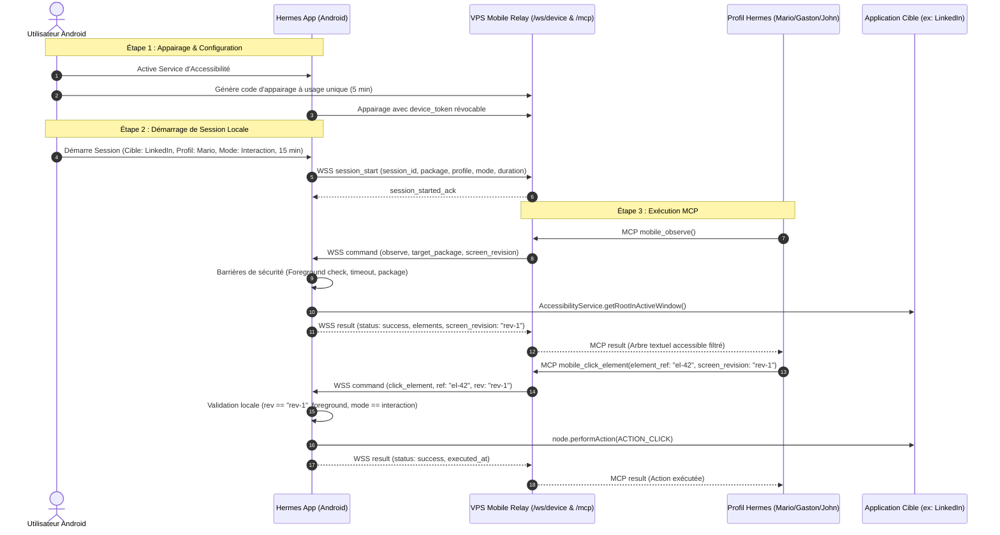

# Spécification Protocole & Architecture — Contrôle Mobile Hermes

**Version du protocole :** `mobile-control/1`  
**Date :** 1er octobre 2026  
**Statut :** Spécification d'implémentation

---

## 1. Topologie & Flux Réseau



---

## 2. Enveloppes des Messages (`mobile-control/1`)

### 2.1 Authentification du Téléphone (WSS)
```json
{
  "protocol": "mobile-control/1",
  "type": "auth",
  "device_id": "dev_a1b2c3d4",
  "device_token": "secret_token_from_pairing"
}
```

### 2.2 Démarrage de Session (Téléphone -> Relais)
```json
{
  "protocol": "mobile-control/1",
  "type": "session_start",
  "session_id": "ses_998877",
  "target_package": "com.linkedin.android",
  "allowed_profile": "mario",
  "mode": "interaction",
  "duration_seconds": 900
}
```

### 2.3 Arrêt de Session (Téléphone -> Relais ou Relais -> Téléphone)
```json
{
  "protocol": "mobile-control/1",
  "type": "session_end",
  "session_id": "ses_998877",
  "reason": "user_cancelled"
}
```

### 2.4 Commande d'action (Relais -> Téléphone)
```json
{
  "protocol": "mobile-control/1",
  "type": "command",
  "command_id": "cmd_550e8400-e29b-41d4-a716-446655440000",
  "session_id": "ses_998877",
  "device_id": "dev_a1b2c3d4",
  "operation": "click_element",
  "target_package": "com.linkedin.android",
  "screen_revision": "rev_1727798400",
  "expires_at": 1727798430000,
  "arguments": {
    "element_ref": "ref_btn_comment",
    "text": null,
    "direction": null
  }
}
```

### 2.5 Résultat d'action (Téléphone -> Relais)
```json
{
  "protocol": "mobile-control/1",
  "type": "result",
  "command_id": "cmd_550e8400-e29b-41d4-a716-446655440000",
  "status": "success",
  "error_code": null,
  "executed_at": 1727798405120,
  "message": "Action exécutée avec succès.",
  "data": {
    "screen_revision": "rev_1727798405",
    "package_name": "com.linkedin.android",
    "elements": [
      {
        "element_ref": "ref_btn_comment",
        "class_name": "android.widget.Button",
        "text": "Commenter",
        "content_desc": "Ajouter un commentaire",
        "clickable": true,
        "editable": false,
        "bounds": "[120, 850][350, 920]"
      }
    ]
  }
}
```

---

### 2.6 Session confirmation and state sync (relay → phone)

A session is **active only after the relay confirms it**. The phone shows it as pending
until `session_started_ack` arrives and never as active on `session_error` or timeout.

| Message | When | Key fields |
|---|---|---|
| `auth_ok` | device authenticated | — |
| `auth_error` | unknown device or bad credentials (socket then closed) | `error_code: DEVICE_AUTH_FAILED` |
| `session_state` | right after `auth_ok` (reconnection sync) | `active`, and if active: `session_id`, `profile`, `device_id`, `target_package`, `mode`, `expires_in_seconds` |
| `session_started_ack` | session registered | `session_id`, `profile`, `device_id`, `expires_in_seconds` |
| `session_error` | session refused | `session_id`, `error_code` (`DEVICE_NOT_AUTHENTICATED`, `PROFILE_NOT_ALLOWED`, `SESSION_REJECTED`), `message` |

The relay is the source of truth. On `session_state` the phone ends a local session the relay
no longer holds, and adopts one it holds but the phone does not know (the agent could act on it,
so the user must see and be able to stop it). The relay drops a device's session when its socket closes.

### 2.7 Correlating logs (no secrets)

Both sides log `event=... key=value` lines with ids only, never tokens:
relay: `device_authenticated`, `device_auth_failed`, `connection_closed` (code, reason),
`session_start_received` (`profile_requested`), `session_registered` / `session_refused`,
`session_ack_sent`, `status_lookup` (`profile` searched, `session_profiles` held, `match`),
`mcp_tool_call` (profile, session, device, mode, `device_connected`), `mcp_tool_result` (status, `error_code`),
`mcp_tool_refused` (reason), `session_desync` (phone code), `device_send_failed`.
Android (logcat tag `MobileControlWS` / `MobileControlManager`): `ws_open`, `auth_ok`, `auth_error`,
`session_start_sent`, `session_ack`, `session_error`, `session_state`, `ws_closed`,
and in `MobileControlManager`: `command_received` (command session vs local session vs pending, `ws_authenticated`),
`command_rejected` (code). Reading one `mobile_observe` across both logs: the relay's `mcp_tool_call` and the
phone's `command_received` share the `command_id`; a `command_rejected code=SESSION_NOT_ON_PHONE` means the
session is absent locally, a `mcp_tool_refused reason=SESSION_REQUIRED` means it is absent on the relay.
`/health` and `mobile_control_status` both expose the relay `instance_id`: if they differ, the phone
and the agent are talking to different relay instances.

---

### 2.8 Screenshots and tap by coordinates (visual fallback)

For interfaces whose accessibility tree is unusable. Consent is **per session, off by default**, given by
the user on the phone and enforced on **both** sides.

- `session_start` carries `allow_screenshots` (boolean, default `false`; only a literal JSON `true` enables it).
  `session_started_ack` and `session_state` echo it. `mobile_control_status` reports it.
- MCP tools: `mobile_screenshot` (no arguments) and `mobile_tap_xy` (`x`, `y` integers in pixels of the last
  screenshot, `screen_revision` returned with it). Both need the consent (`SCREENSHOTS_NOT_ALLOWED` otherwise,
  refused by the relay before anything reaches the phone). `mobile_tap_xy` is also interaction-only
  (`MODE_DENIED` in observation mode); `mobile_screenshot` is allowed in observation mode once consented.
- Phone command `screenshot` answers with the usual observation plus `data.screenshot`:
  `{"mime_type": "image/jpeg", "width", "height", "data": "<base64>"}`. The relay accepts JPEG only, valid base64,
  at most 1,000,000 decoded bytes, and forwards it to the agent as an MCP `image` block next to a text block.
  An image sent for any other operation is dropped.
- Phone command `tap_xy` carries `arguments.x`, `arguments.y` and `screen_revision`. The coordinates are pixels of
  the last screenshot; the tap is refused unless it is for that capture's revision, no older than 15 s, and the
  screen did not change since (a new window or a scroll drops the capture's context); every attempt spends it.
- **What is captured.** Only the **window of the target app** (never the whole display), and only while that
  app is still in the foreground before and after the frame. Password fields that are hidden are blacked out
  before encoding; a password shown in clear cannot be detected. Protected (`FLAG_SECURE`) windows are refused
  by Android. The consent is the **intersection** of the user's choice on the phone and the relay's echo: the
  relay can remove it but never grant it, and a session adopted from the relay never has screenshots.
- **Never stored, never logged.** The relay keeps the image in memory for the response only. The audit log
  records `SCREENSHOT` with byte count and dimensions, and logs `screenshot_forwarded` / `screenshot_rejected` /
  `screenshot_dropped` without content.

- **WebUI side.** The worker turns MCP `image` blocks into Hermes's multimodal envelope. The dispatcher then applies
  Hermes's vision rule for the profile: a model that reads images gets the image; otherwise the auxiliary vision
  model describes it and the agent gets **text only**. The auxiliary path writes the image to a private temporary
  directory (0600 files) on the WebUI host, deleted right after the call. The image therefore leaves toward the
  profile's model provider, or its auxiliary vision provider: this is what the phone's consent dialog says.

### 2.9 Calendar read (native bridge, first slice)

Read-only, **per-session consent, off by default**, separate from the screenshot consent (one never opens the other).

- `session_start` carries `allow_calendar` (boolean, default `false`; only a literal JSON `true` enables it).
  `session_started_ack` and `session_state` echo it; `mobile_control_status` reports it. The effective consent is
  the **intersection** of the phone's choice and the relay's echo; a session adopted from the relay never has it.
- MCP tool `mobile_calendar_events` (optional `days`, integer 1..7, default 7). Refused by the relay before anything
  reaches the phone without consent (`CALENDAR_NOT_ALLOWED`). Allowed in observation mode: it taps and types nothing.
- Phone command `calendar_read` (`arguments.days`). The phone answers a `result` with a top-level `calendar_events`
  list, each `{title, start_ms, end_ms, location, all_day}`: nothing else is read (no attendees, notes or organiser),
  only calendars the user shows, from now to at most 7 days ahead, at most 50 events. If Android refused the
  permission the phone answers `CALENDAR_PERMISSION_MISSING`.
- The relay does not trust the list: unknown fields are dropped on parsing, at most 50 events and 200 characters per
  text are forwarded, newlines are flattened, and events sent for any other operation are dropped. The agent gets
  one text block, times in UTC.
- **Never stored, never logged.** The audit records `CALENDAR_READ` with the count; logs carry `calendar_forwarded`
  with the count only. Titles and places are held in memory for the response.

## 3. Codes d'Erreur Normalisés

| Code d'Erreur | Signification |
|---|---|
| `DEVICE_OFFLINE` | Le téléphone n'est pas connecté au relais WebSocket |
| `SESSION_REQUIRED` | **Le relais** n'a aucune session active pour le profil (le téléphone n'a pas été interrogé) |
| `SESSION_NOT_ON_PHONE` | Le relais a une session, **le téléphone n'en a aucune** (le relais ferme alors la sienne) |
| `SESSION_ID_MISMATCH` | Le téléphone a une **autre** session que celle du relais (le relais ferme la sienne) |
| `SESSION_PENDING_ON_PHONE` | Le téléphone attend encore la confirmation du relais pour cette session : réessayer (le relais ne ferme rien) |
| `SCREENSHOTS_NOT_ALLOWED` | L'utilisateur n'a pas autorisé les captures pour cette session (refusé côté relais et côté téléphone) |
| `SCREENSHOT_UNSUPPORTED` | Android < 14 (API 34) : seule la capture d'une fenêtre unique y est possible ; sur les versions antérieures la seule option serait tout l'écran, ce qui inclurait notifications et surimpressions d'autres applications |
| `SCREENSHOT_BLOCKED_SECURE_WINDOW` | La fenêtre est protégée (`FLAG_SECURE`) : Android refuse la capture |
| `CALENDAR_NOT_ALLOWED` | L'utilisateur n'a pas autorisé la lecture du calendrier pour cette session (refusé côté relais et côté téléphone) |
| `CALENDAR_PERMISSION_MISSING` | Android n'a pas accordé l'accès au calendrier à l'application |
| `SCREENSHOT_TOO_FAST` | Capture demandée trop tôt après la précédente : réessayer |
| `SCREENSHOT_TOO_LARGE` | Image au-delà de 1 000 000 octets décodés |
| `SCREENSHOT_INVALID` | Image absente, vide, non JPEG ou base64 invalide |
| `INVALID_ARGUMENTS` | Arguments d'outil mal formés (par exemple coordonnées non entières) |
| `SESSION_EXPIRED` | La durée maximale de la session (5/15/30 min) a expiré |
| `PROFILE_DENIED` | Le profil demandeur (ex: Gaston) n'est pas celui autorisé (ex: Mario) |
| `APP_NOT_ALLOWED` | Le package demandé n'a pas été autorisé sur le téléphone |
| `APP_NOT_FOREGROUND` | L'application cible n'est pas actuellement au premier plan |
| `ACCESSIBILITY_DISABLED` | Le service d'accessibilité Hermes n'est pas actif |
| `DEVICE_LOCKED` | Le téléphone est verrouillé |
| `MODE_DENIED` | Action d'écriture/clic refusée car la session est en mode "observation" |
| `STALE_SCREEN` | La révision d'écran a changé depuis la dernière observation |
| `UNSUPPORTED_UI` | L'élément ou l'interface n'expose pas de nœud accessible standard |
| `COMMAND_EXPIRED` | Le délai de validité de la commande est dépassé |
| `DUPLICATE_COMMAND` | L'identifiant de commande a déjà été traité |
| `ACTION_FAILED` | L'action Android `performAction` a échoué |
| `RESULT_UNKNOWN` | Perte réseau pendant l'exécution : pas de réexécution aveugle |
