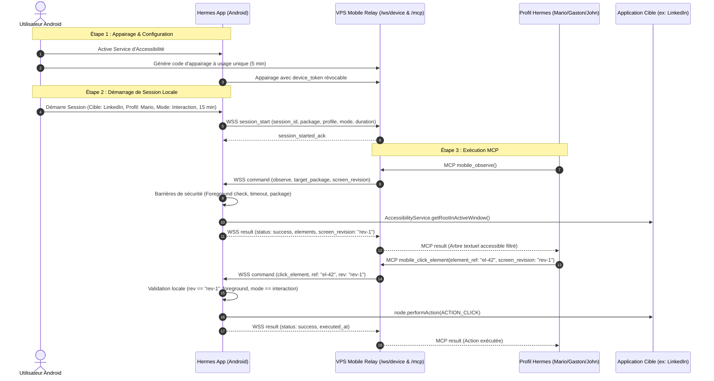

# Spécification Protocole & Architecture — Contrôle Mobile Hermes

**Version du protocole :** `mobile-control/1`  
**Date :** 1er octobre 2026  
**Statut :** Spécification d'implémentation

---

## 1. Topologie & Flux Réseau



---

## 2. Enveloppes des Messages (`mobile-control/1`)

### 2.1 Authentification du Téléphone (WSS)
```json
{
  "protocol": "mobile-control/1",
  "type": "auth",
  "device_id": "dev_a1b2c3d4",
  "device_token": "secret_token_from_pairing"
}
```

### 2.2 Démarrage de Session (Téléphone -> Relais)
```json
{
  "protocol": "mobile-control/1",
  "type": "session_start",
  "session_id": "ses_998877",
  "target_package": "com.linkedin.android",
  "allowed_profile": "mario",
  "mode": "interaction",
  "duration_seconds": 900
}
```

### 2.3 Arrêt de Session (Téléphone -> Relais ou Relais -> Téléphone)
```json
{
  "protocol": "mobile-control/1",
  "type": "session_end",
  "session_id": "ses_998877",
  "reason": "user_cancelled"
}
```

### 2.4 Commande d'action (Relais -> Téléphone)
```json
{
  "protocol": "mobile-control/1",
  "type": "command",
  "command_id": "cmd_550e8400-e29b-41d4-a716-446655440000",
  "session_id": "ses_998877",
  "device_id": "dev_a1b2c3d4",
  "operation": "click_element",
  "target_package": "com.linkedin.android",
  "screen_revision": "rev_1727798400",
  "expires_at": 1727798430000,
  "arguments": {
    "element_ref": "ref_btn_comment",
    "text": null,
    "direction": null
  }
}
```

### 2.5 Résultat d'action (Téléphone -> Relais)
```json
{
  "protocol": "mobile-control/1",
  "type": "result",
  "command_id": "cmd_550e8400-e29b-41d4-a716-446655440000",
  "status": "success",
  "error_code": null,
  "executed_at": 1727798405120,
  "message": "Action exécutée avec succès.",
  "data": {
    "screen_revision": "rev_1727798405",
    "package_name": "com.linkedin.android",
    "elements": [
      {
        "element_ref": "ref_btn_comment",
        "class_name": "android.widget.Button",
        "text": "Commenter",
        "content_desc": "Ajouter un commentaire",
        "clickable": true,
        "editable": false,
        "bounds": "[120, 850][350, 920]"
      }
    ]
  }
}
```

---

## 3. Codes d'Erreur Normalisés

| Code d'Erreur | Signification |
|---|---|
| `DEVICE_OFFLINE` | Le téléphone n'est pas connecté au relais WebSocket |
| `SESSION_REQUIRED` | Aucune session n'a été démarrée par l'utilisateur |
| `SESSION_EXPIRED` | La durée maximale de la session (5/15/30 min) a expiré |
| `PROFILE_DENIED` | Le profil demandeur (ex: Gaston) n'est pas celui autorisé (ex: Mario) |
| `APP_NOT_ALLOWED` | Le package demandé n'a pas été autorisé sur le téléphone |
| `APP_NOT_FOREGROUND` | L'application cible n'est pas actuellement au premier plan |
| `ACCESSIBILITY_DISABLED` | Le service d'accessibilité Hermes n'est pas actif |
| `DEVICE_LOCKED` | Le téléphone est verrouillé |
| `MODE_DENIED` | Action d'écriture/clic refusée car la session est en mode "observation" |
| `STALE_SCREEN` | La révision d'écran a changé depuis la dernière observation |
| `UNSUPPORTED_UI` | L'élément ou l'interface n'expose pas de nœud accessible standard |
| `COMMAND_EXPIRED` | Le délai de validité de la commande est dépassé |
| `DUPLICATE_COMMAND` | L'identifiant de commande a déjà été traité |
| `ACTION_FAILED` | L'action Android `performAction` a échoué |
| `RESULT_UNKNOWN` | Perte réseau pendant l'exécution : pas de réexécution aveugle |
